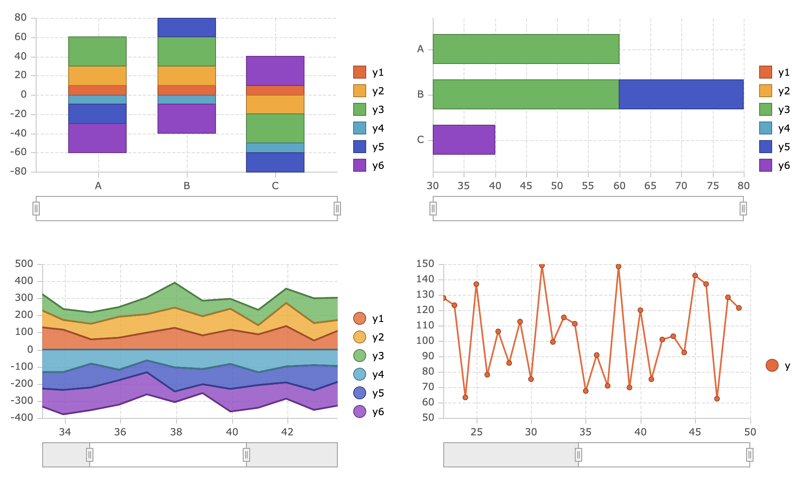

# vkCharts

## Features

Here are some of the features that make vkCharts stand out:

- modern and performant
- lightweight, with zero dependencies
- framework agnostic
- written in TypeScript
- supports most common chart types:
  - Line Charts
  - Bar/Column Charts
  - Area Charts
  - Scatter/Bubble Charts
  - Pie/Donut Charts
- reactive - property changes are automatically batched to take effect on the next frame (no manual updates, no excessive re-renders)
- simple, clean API
- easy to integrate with third-party frameworks or to use with plain JS/TS

## Disclosure

vkCharts were developed as an MIT licensed library by Vitalii Kravchenko during his employment at AG GRID LTD.
This code is based on a fork of AG Charts at the time of Vitalii's last commit.

## Getting Started

`npm i`

`mkdir dist`

## Running Examples

`npm start examples/<example-folder>`

For example: `npm start examples/bar-series`

## Dependencies

None.

## Dev Dependencies

- `typescript` - vkCharts are written in TypeScript. This dependency is used for type checking.
- `esbuild` - Used as the TypeScript transpiler, the build tool, and the development server.
- `jest` - Testing framework with assertion and mocking libraries, and a test runner.
- `ts-jest` - Jest can only run plain JavaScript and needs a transformer like this one for TypeScript.
- `@jest/globals` - Declaration file for the `jest` object, matchers and other exported Jest functions. Jest exposes these on the `global` object, when the tests are running, so this is only needed to allow explicit imports and better IDE experience.
- `jest-environment-jsdom` - Tests run in the Node environment, but vkCharts is a front-end library. This dependency allows simulating a browser-like environment.
- `jest-canvas-mock` - jest-environment-jsdom mocks `HTMLCanvasElement` but not its `CanvasRenderingContext2D`. This dependency takes care of that.
- `prettier` - Ensures consistent code formatting in the codebase.
- `redecorate.js` - A script in this project (not an npm package) used for code generation. When run, looks for lines in changed files that have the following TypeScript legacy decorator format `@reactive('event1', 'event2', ...) property = value;` and transforms them to regular TypeScript. TypeScript's legacy decorators are exactly that at this point - legacy. Likewise, Stage 3 decorators are still a non-standard language feature, as the name implies, and also can't take event parameters like legacy decorators could. So we use code generation instead, to save ourselves from typing a lot of boilerplate code and using outdated and experimental language features.
