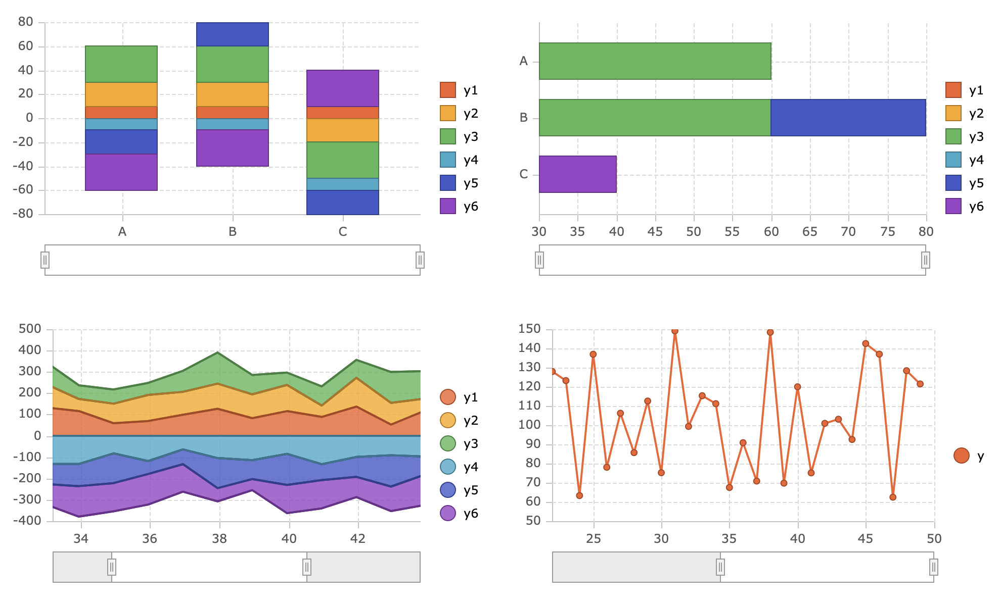

# vkCharts

## Features

Here are some of the features that make vkCharts stand out:

- modern, lightweight and performant
- framework agnostic, easy to use from plain JavaScript or TypeScript
- zero dependencies
- support for common chart types:
  - Line Charts
  - Bar/Column Charts
  - Area Charts
  - Scatter/Bubble Charts
  - Pie/Donut Charts
- reactive - property changes are automatically batched to take effect on the next frame
- simple, clean API
- easy to integrate with third-party frameworks

## Disclosure

VkCharts were developed by Vitalii Kravchenko during his employment at AG GRID LTD.
This code is based on a fork of AG Charts at the time of Vitalii's last commit
and has code developed by others stripped away.

## Getting Started

`yarn`

## Running examples

`yarn vite examples/<example-folder>`

For example: `yarn vite examples/bar-series`